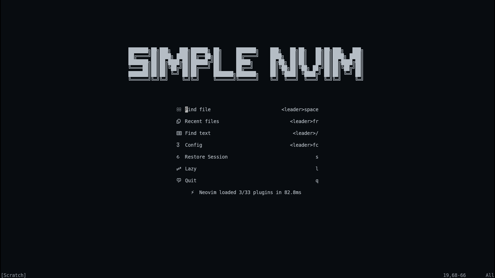
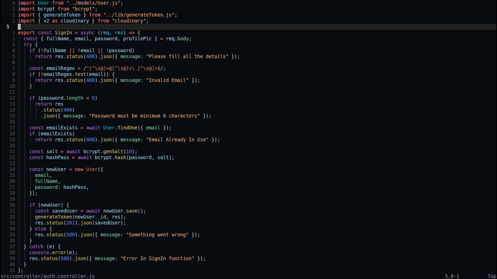
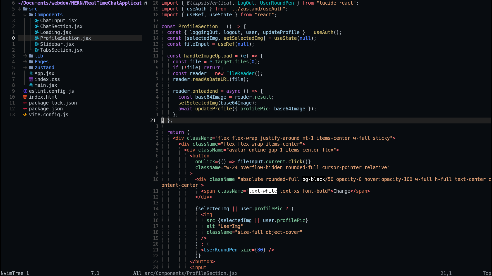
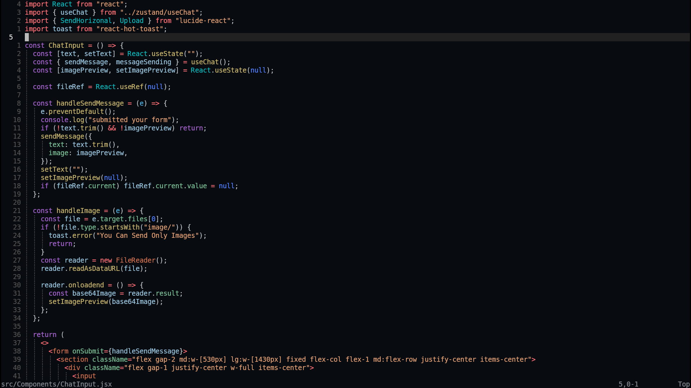
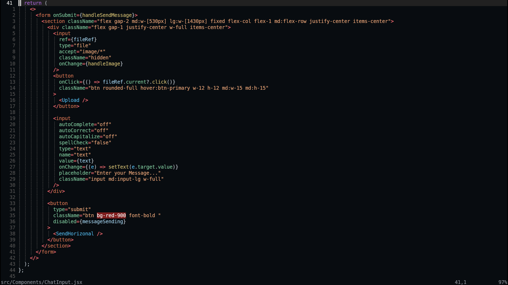

# Installation In MacOs And Linux

```
git clone https://github.com/msa-developer/simplenvim ~/.config/nvim

```













### After the installation remove .git file and images folder they are not required


Keymappings

General
- Mode: n = normal, v = visual, x = visual (select), i = insert, t = terminal, [] = multiple

| Keys | Mode | Action |
|------|------|--------|
| Space | n/v | Leader key |
| <Esc> | n | Clear search highlights and return to normal mode |
| jk | i | Exit insert mode |
| <leader>cf | n/v | Format file or selection (conform) |
| j | n/x | Down (wrap-aware) |
| <Down> | n/x | Down (wrap-aware) |
| k | n/x | Up (wrap-aware) |
| <Up> | n/x | Up (wrap-aware) |

Diagnostics
| Keys | Mode | Action |
|------|------|--------|
| <leader>cd | n | Line diagnostics float |
| ]d | n | Next diagnostic |
| [d | n | Previous diagnostic |
| ]e | n | Next error |
| [e | n | Previous error |
| ]w | n | Next warning |
| [w | n | Previous warning |

Lazy and Mason
| Keys | Mode | Action |
|------|------|--------|
| <leader>l | n | Open Lazy UI |
| <leader>cm | n | Open Mason |

Terminal
| Keys | Mode | Action |
|------|------|--------|
| Ctrl+/ | n/t | Toggle floating terminal in current dir |

Window Management
| Keys | Mode | Action |
|------|------|--------|
| <leader>wh | n | Go to left window |
| <leader>wj | n | Go to lower window |
| <leader>wk | n | Go to upper window |
| <leader>wl | n | Go to right window |
| <leader>ww | n | Switch to next window |
| <leader>wH | n | Move window far left |
| <leader>wL | n | Move window far right |
| <leader>wK | n | Move window to top |
| <leader>wJ | n | Move window to bottom |
| <leader>ws | n | Split window below |
| <leader>wv | n | Split window right |
| <leader>wc | n | Close current window |
| <leader>wx | n | Swap current window |
| <leader>w= | n | Equalize window sizes |
| <leader>w+ | n | Increase window height |
| <leader>w- | n | Decrease window height |
| <leader>w> | n | Increase window width |
| <leader>w< | n | Decrease window width |
| <leader>wm | n | Maximize/minimize a split (vim-maximizer) |

Move Lines
| Keys | Mode | Action |
|------|------|--------|
| Alt-j | n | Move current line down (repeatable) |
| Alt-k | n | Move current line up (repeatable) |
| Alt-j | i | Move current line down, stay in insert |
| Alt-k | i | Move current line up, stay in insert |
| Alt-j | v | Move selected lines down |
| Alt-k | v | Move selected lines up |

Buffers
| Keys | Mode | Action |
|------|------|--------|
| <S-h> | n | Previous buffer |
| <S-l> | n | Next buffer |
| [b | n | Previous buffer |
| ]b | n | Next buffer |
| <leader>bb | n | Switch to alternate buffer |
| <leader>` | n | Switch to alternate buffer |
| <leader>bd | n | Delete buffer |
| <leader>bD | n | Delete buffer and window |
| <leader>bo | n | Delete other buffers |
| <leader>br | n | Delete buffers to the right |
| <leader>bl | n | Delete buffers to the left |

Git
| Keys | Mode | Action |
|------|------|--------|
| <leader>gB | n/x | Open current file on GitHub in browser |
| <leader>gg | n | Open LazyGit |
| <leader>gs | n | Telescope: Git status |
| <leader>gl | n | Telescope: Git commits |

Tmux Navigator
| Keys | Mode | Action |
|------|------|--------|
| Ctrl-h | n | TmuxNavigateLeft |
| Ctrl-j | n | TmuxNavigateDown |
| Ctrl-k | n | TmuxNavigateUp |
| Ctrl-l | n | TmuxNavigateRight |
| Ctrl-\ | n | TmuxNavigatePrevious |

Explorer (nvim-tree)
| Keys | Mode | Action |
|------|------|--------|
| <leader>E | n | Toggle file explorer |
| <leader>e | n | Toggle explorer focused on current file |

Telescope
| Keys | Mode | Action |
|------|------|--------|
| <leader><space> | n | Find files (root dir) |
| <leader>/ | n | Live grep (root dir) |
| <leader>, | n | Switch buffer |
| <leader>: | n | Command history |
| <leader>f" | n | Registers |
| <leader>gf | n | Find Git files |
| <leader>fr | n | Recent files |
| <leader>fh | n | Help tags |
| <leader>fk | n | Keymaps |
| <leader>fD | n | Diagnostics (all) |
| <leader>fd | n | Diagnostics (current buffer) |
| <leader>fw | n | Grep string under cursor in cwd |
| <leader>fM | n | Man pages |
| <leader>fj | n | Jumplist |
| <leader>fm | n | Marks |
| <leader>fC | n | Colorscheme |
| <leader>fb | n | Fuzzy find in current buffer |
| <leader>fB | n | Live grep open buffers |
| <leader>f/ | n | Search history |
| <leader>fc | n | Find Neovim config files |

Trouble
| Keys | Mode | Action |
|------|------|--------|
| <leader>xx | n | Toggle diagnostics list |
| <leader>xX | n | Toggle buffer diagnostics |
| <leader>cs | n | Toggle symbols |
| <leader>cl | n | Toggle LSP (defs/refs etc.) on right |
| <leader>xL | n | Toggle location list |
| <leader>xQ | n | Toggle quickfix list |

Mini Surround
| Keys | Mode | Action |
|------|------|--------|
| gsa | n/v | Add surrounding |
| gsd | n | Delete surrounding |
| gsf | n | Find right surrounding |
| gsF | n | Find left surrounding |
| gsh | n | Highlight surrounding |
| gsr | n | Replace surrounding |
| gsn | n | Update surrounding n_lines |
